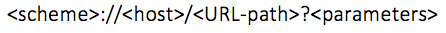
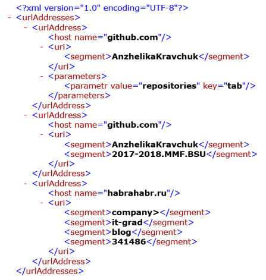

Day19
---

В текстовом файле построчно хранится информация об URL-адресах, представленных в виде:

где сегмент parameters - это набор пар вида key=value, при этом сегменты URL‐path и parameters или сегмент parameters могут отсутствовать.
[Разработать систему типов](https://github.com/RomanGutovec/NET1.A.2018.Gutovec.19/tree/master/XmlLib) 
(руководствоваться принципами SOLID) для экспорта данных, полученных на основе разбора информации текстового 
файла, в XML-документ по следующему правилу, например, для текстового файла с URL-адресами

 *  https://github.com/AnzhelikaKravchuk?tab=repositories
 *  https://github.com/AnzhelikaKravchuk/2017-2018.MMF.BSU
 *  https://habrahabr.ru/company/it-grad/blog/341486/

результирующим является XML-документ вида (можно использовать любую XML технологию без ограничений). XML-результат:

Для тех URL-адресов, которые не совпадают с данным паттерном, “залогировать” информацию, отметив указанные строки, как необработанные. 

Продемонстрировать работу на примере [консольного приложения](https://github.com/RomanGutovec/NET1.A.2018.Gutovec.19/tree/master/XmlLibConsole).

Какие изменения нужно будет внести в систему типов, если в исходном текстовом файле информация об URL-адресах изменится на другую, 
иерархически представимую информацию.

[Решение](https://github.com/RomanGutovec/NET1.A.2018.Gutovec.19/tree/master/XmlLib) 
